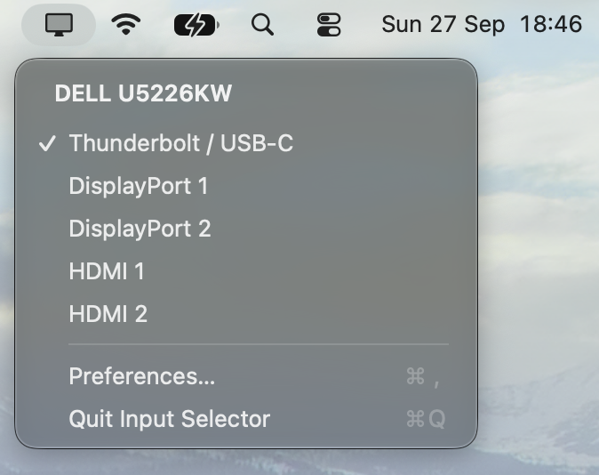

# QISME

Quick Input Selector, Mac Edition

A simple input selector for macOS.



## Requirements

- Apple Silicon Mac
- macOS 13 or later
- A monitor that supports input switching over DDC/CI

## Build

```sh
git submodule update --init --recursive
bash scripts/build-macos.sh  # app
bash scripts/build-dmg.sh    # drag-to-install DMG
```

### Tests

```sh
bash scripts/test-macos.sh
python3 scripts/test-reproducible.py
```

## Dependencies

[m1ddc](https://github.com/waydabber/m1ddc)

## License

[MIT](LICENSE).
